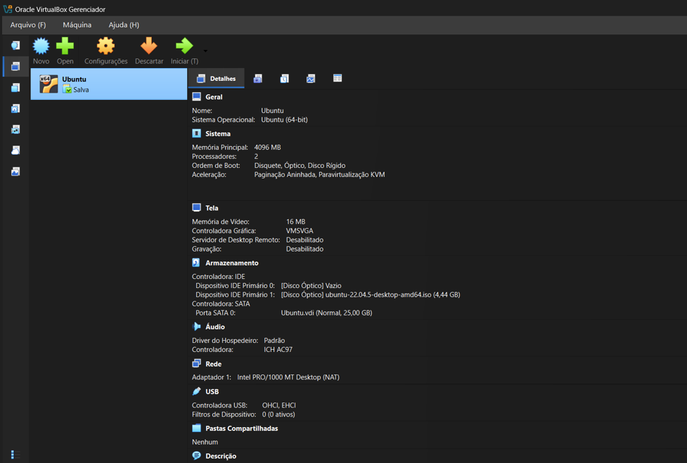
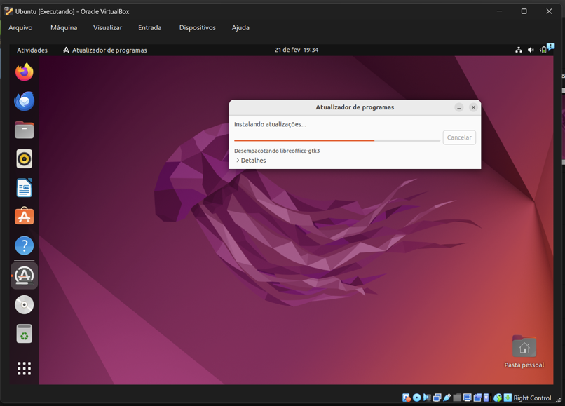

# Semana 1: Instalação e Configuração da Máquina Virtual

Na primeira semana, o foco foi montar o ambiente local necessário para as atividades práticas da disciplina, com a criação de uma Máquina Virtual e a instalação do sistema Linux.

## 1. Configuração da Máquina Virtual no VirtualBox

O processo teve início com a configuração do hardware virtualizado no Oracle VirtualBox. Conforme ilustrado na imagem a seguir, a VM foi definida com o sistema **Ubuntu (64-bit)**, com **4096 MB de RAM** (2 processadores) e um disco virtual de **25 GB**, assegurando desempenho adequado para as ferramentas utilizadas na disciplina.

## 2. Instalação do Ubuntu

Com a inicialização feita a partir da imagem ISO `ubuntu-22.04.5-desktop-amd64.iso`, foi realizado o processo completo de instalação do sistema operacional, incluindo a definição de fuso horário, configuração do teclado e criação do usuário principal.

## 3. Atualização do Sistema

Com o sistema instalado e funcionando, a primeira ação realizada foi executar o atualizador de pacotes do Ubuntu. Essa etapa é fundamental para garantir que todos os componentes do sistema estejam atualizados e seguros antes de prosseguir com a instalação de outras ferramentas.

