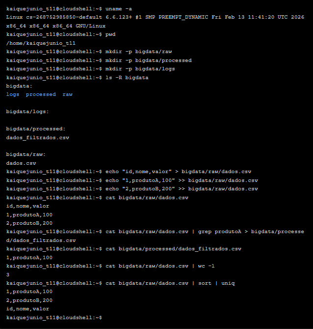
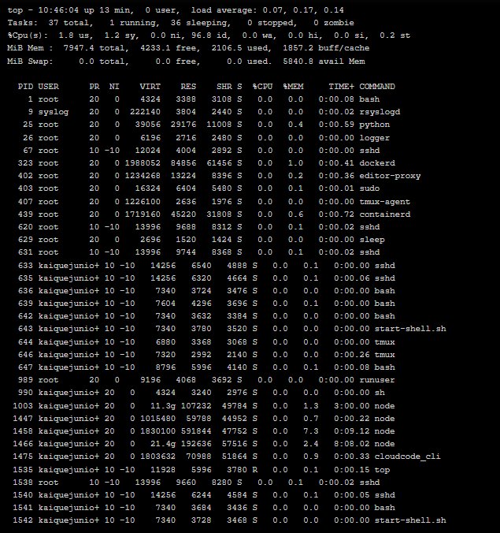
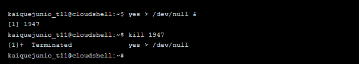
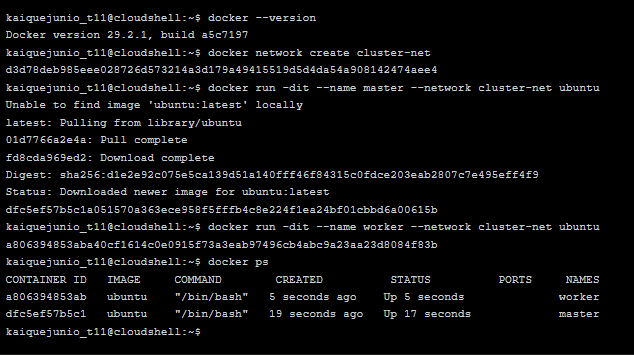
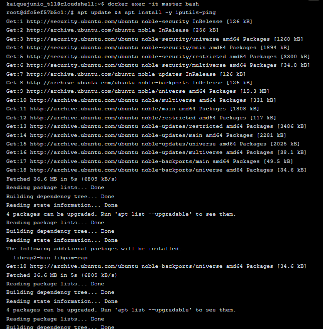
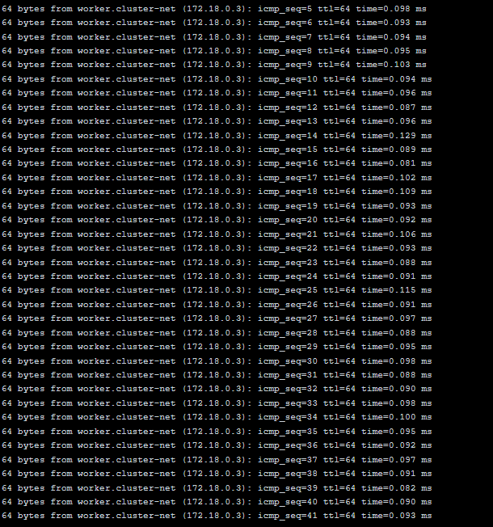

# Semana 2: Terminal Linux no GitHub Codespaces

Nesta semana o foco foi a prática com o terminal Linux dentro do GitHub Codespaces. As atividades cobriram os principais comandos de administração de sistemas, construindo a base necessária para trabalhar com ferramentas de infraestrutura de Big Data nas semanas seguintes.

## 1. Atualização do Sistema

O primeiro passo foi sincronizar a lista de pacotes e atualizar os programas já instalados no ambiente.

```bash
sudo apt update
sudo apt upgrade -y
```





## 2. Navegação, Manipulação de Arquivos e Processos

Nesta etapa foram explorados os diretórios do sistema, criada a pasta `aula_bigdata`, realizada a manipulação de arquivos de texto e instalada a ferramenta `tree` para visualização hierárquica de diretórios.

Comandos utilizados: `pwd`, `ls`, `ls -la`, `cd`, `mkdir`, `touch`, `echo`, `cat`, `cp`, `mv`, `rm` e `tree`.



## 3. Permissões, Compactação e Teste de Rede

Com os arquivos criados, foram aplicadas permissões, testada a compactação da pasta e executados comandos de rede para identificar o IP público do ambiente.

```bash
chmod 755 arquivo1.txt
tar -czvf backup.tar.gz aula_bigdata/
tar -xzvf backup.tar.gz
ping google.com
curl ifconfig.me
```



## 4. Instalação do Java (Pré-Hadoop)

Para viabilizar o uso de ferramentas como Hadoop e Spark nas próximas semanas, foi instalado o Java Development Kit e verificada a versão ativa no sistema.

```bash
sudo apt install openjdk-11-jdk -y
java -version
```



---

## Dificuldades Encontradas e Aprendizados

A prática gerou situações reais de depuração que resultaram em aprendizados importantes:

1. **Erro na compactação com `tar`:** Ao rodar `tar -czvf backup.tar.gz aula_bigdata/`, o terminal retornou erro informando que o diretório não foi encontrado. A causa foi estar **dentro** da pasta `aula_bigdata` no momento do comando. Para compactar um diretório inteiro, é preciso executar o comando a partir do nível acima dele.

2. **`ping` não encontrado:** O comando `ping google.com` retornou `bash: ping: command not found`. Isso ocorre porque imagens de container minimalistas, como a usada pelo Codespaces, não incluem o pacote `iputils-ping` por padrão. A solução é instalá-lo manualmente com `sudo apt install iputils-ping`.

3. **Versão do Java diferente da solicitada:** Mesmo especificando `openjdk-11-jdk` na instalação, o comando `java -version` retornou a versão 25 da Microsoft. Em ambientes gerenciados como o Codespaces, uma versão do Java já presente no container pode ter precedência sobre a recém-instalada, exigindo a configuração manual das alternativas com `update-alternatives`.
